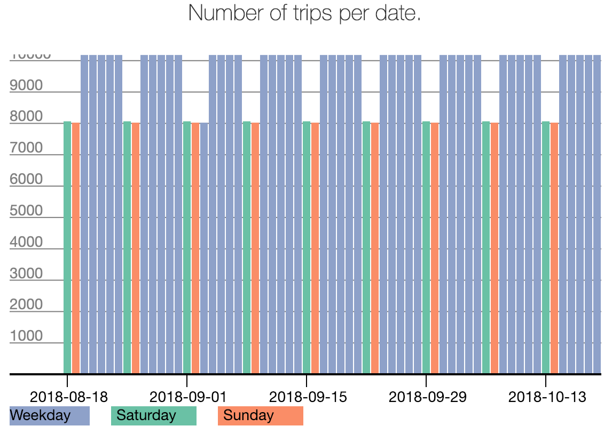
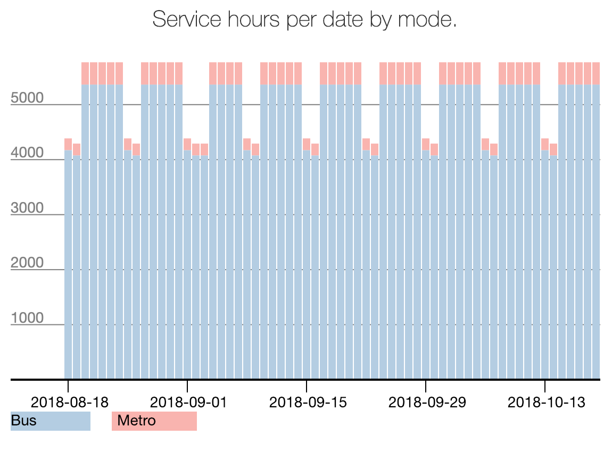
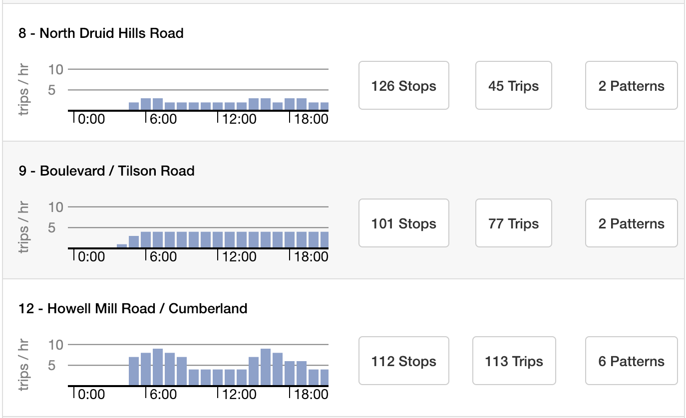
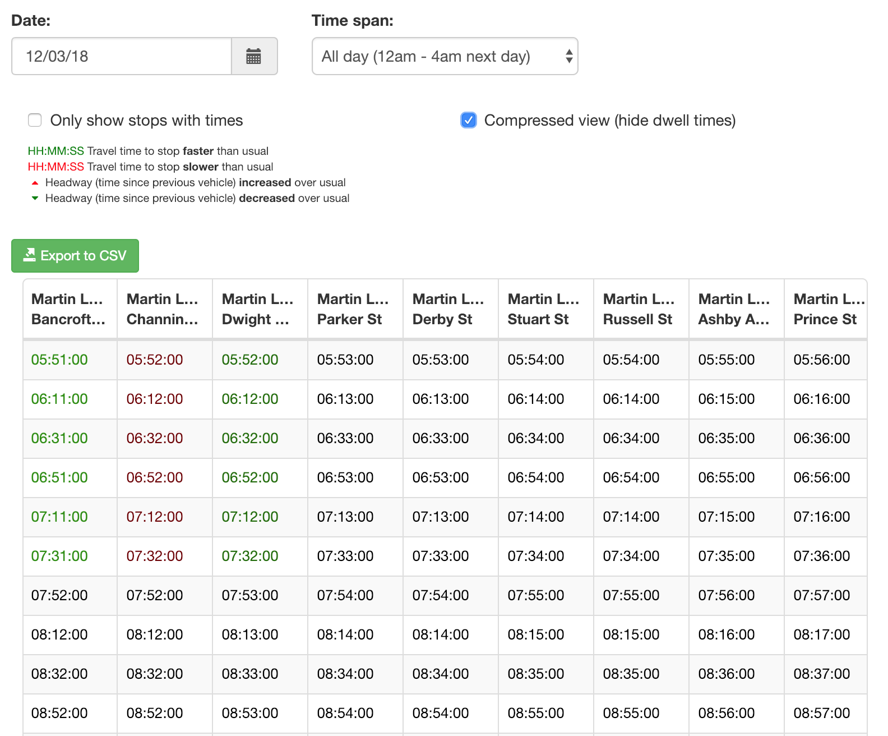

# Feed Version Summary

## Navigation

The Feed Version navigator allows you to navigate through all available versions of a given feed using the `←` and `→` buttons (or view a list of all versions). You can also use this interface to:

- download a Feed Version to your local machine as a GTFS data file,
- export the route patterns or stops as a shapefile (.shp),
- merge two Feed Versions into a single version (MTC only),
- publish a Feed Version externally (MTC only),
- load a version into the Editor, and
- delete a Feed Version from the Data Manager. (Note: deleting a Feed Version cannot be undone.)

To the left of the navigator is a list of views available for to the currently active version. These include basic feed statistics, the detailed feed validation report, and any user comments specific to this feed. See [Feed Version Summary](./feed-version-summary) for more.

## Feed Version Quality Checks

Each Feed Version loaded into the Data Manager will be processed and validated. Below is a rundown of the different components you will find in the feed summary view to help check the GTFS for quality and drill down into its contents.

This chart shows the total number of trips in service for each calendar date in the GTFS feed.

This chart shows the total number of service hours by date for each mode contained within the GTFS feed.

By clicking the route or pattern tabs, users can view histograms showing the total trips per hour for any given date in the GTFS feed. Note: route histograms contain multiple patterns (or sets of unique stop sequences).

By clicking the timetable tab, users can view detailed timetable information for any trip pattern and date in the GTFS feed. If there is variation in the headways or travel time between stops over the course of the day, red or green indicators will indicate speed ups and slow downs, respectively.
