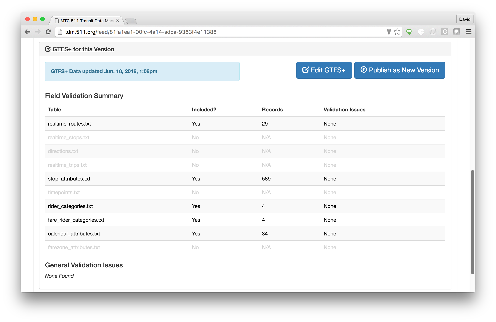
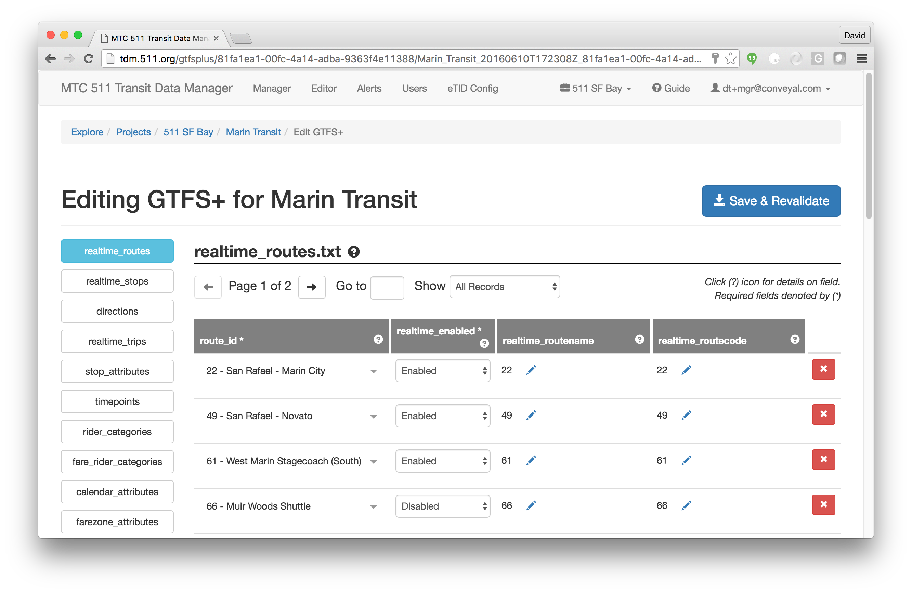
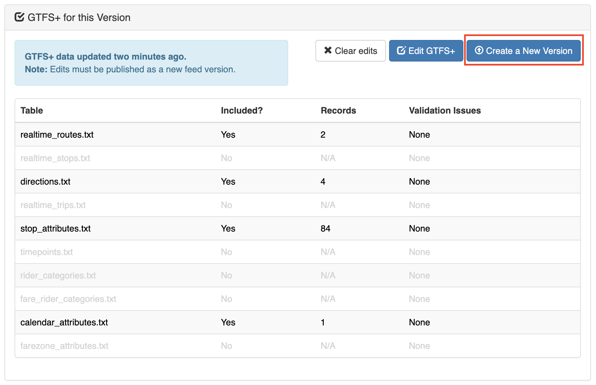
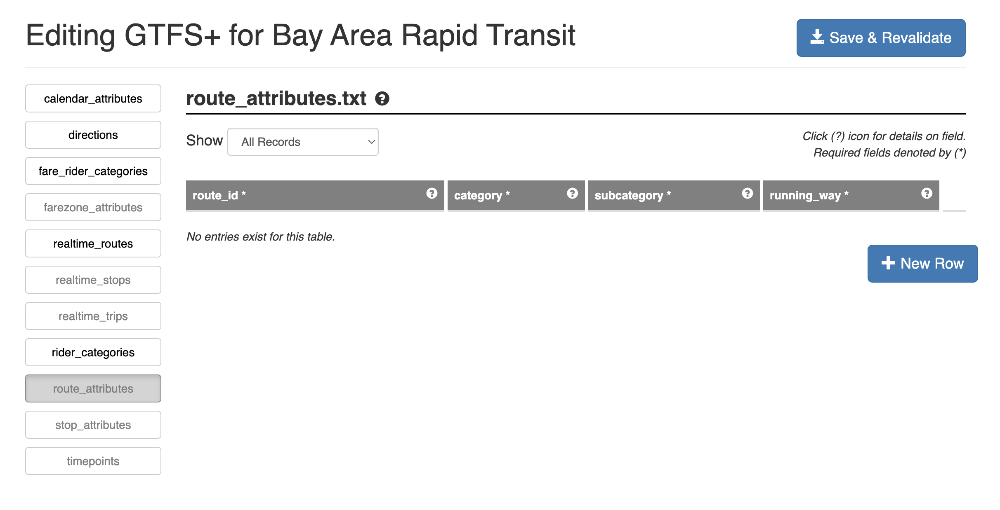
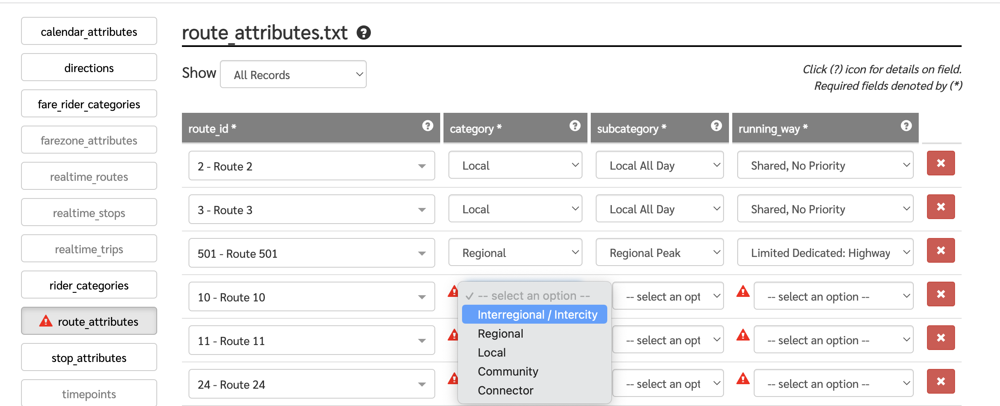
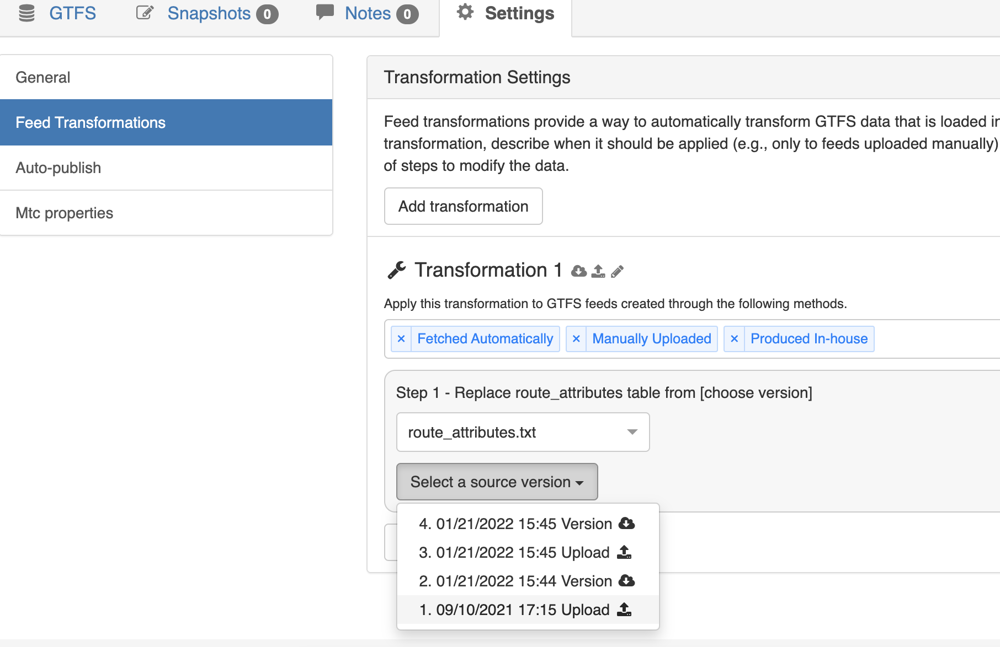

# GTFS+ Editor

## Overview
The GTFS+ Editor provides an interface for viewing and editing the additional data tables defined by the GTFS+ extension to the GTFS format.

Any GTFS feed managed in the Data Manager may optionally include GTFS+ data. GTFS+ tables, when present, are included in the same Zip file as the primary GTFS tables; the Data Manager will automatically recognize and process GTFS+ data for any feed where such data is included. The application also allows users to create new GTFS+ tables from scratch for any feed in the system.

## Viewing GTFS+ Status for a Feed Version

Within the main Feed Source page, the Feed Version navigator includes an expandable "GTFS+" panel showing the status of any GTFS+ for that Feed Version:

In the above example, the loaded Feed Version includes GTFS+ data for 5 of the 11 possible GTFS+ tables. The table labeled *Feed Validation Summary* provides an overview of which GTFS+ tables are included, and for those that are, the total number of records and how many records have known validation issues. A second section, *General Validation Issues*, includes other issues that are not specific to individual table records. These can include missing required columns or other structural problems detected within the GTFS+ data.

## Editing GTFS+ Data for a Feed Version

Within the GTFS+ panel of the Feed Version viewer described above there an "Edit GTFS+" button. Clicking this will open the main GTFS+ Editor interface:

Major elements of the editor interface include:

* The *main table view* is where a single GTFS+ table is displayed for editing. The user can interact directly with any field; depending on the field type, it will be editable as either a dropdown selector, an interactive GTFS search field (for selecting known stops and routes), or as a plain text input. Fields that are required are marked as an asterisk in the column header.
* The *table selector column* on the left-hand side lists all possible GTFS+ tables, and is used to select which table is currently being edited. Tables that include records with known validation issues are marked with a red 'X'.
* The *table navigator* immediately above the main table view allows users to navigate through longer tables as a series of pages (at most 25 records are shown on one page). Also included is a dropdown selector that allows filtering of the displayed records by validation status.
* The *"New Row" button* at the bottom of the main table view is used to add a new empty record to the end of the current table.
* *Help icons*, marked with the '?' sign, can be clicked to display a description of individual tables and table columns.

After making changes to the data, the "Save and Revalidate" button can be used to save changes to the server and re-run the validation process. The saved changes overwrite any previous GTFS+ data stored for the given Feed Version. The GTFS+ summary table in the main Feed Version viewer (described above) will be updated to reflect the latest changes.

## Exporting GTFS+ to a New Version

Once the GTFS+ data for a given Feed Version is to a point where it is complete and ready for external use, it may be exported as a new Feed Version in the main Data Manager using the "Create a New Version" button within the GTFS+ summary panel (note that this button does not appear until the GTFS+ for a given Feed Version has been edited and saved at least once). In addition to the updated GTFS+ data, any standard GTFS data from the original Feed Version will be retained and included in the newly created version.

## Editing `route_attributes.txt`

### Opening the GTFS+ Editor

From the Feed Version viewer, clicking the "GTFS+ for this version" shortcut on the left side of the screen will open the GTFS+ summary page that lists GTFS+ files and validation summary.

If editing `route_attributes.txt` from scratch, the row for `route_attributes.txt` will be grayed out in the GTFS+ summary page. Click "Edit GTFS+" to the top-right corner to open the GTFS+ Editor.

Note that route attributes can only be added for the transit routes defined for the active agency feed. To edit route attributes for another agency, navigate back to the applicable project and select the desired agency and feed version.

### Route Attributes Editor Overview

Once in the GTFS+ editor, select "route_attributes" from the GTFS+ files shown on the left side. "route_attributes" will be grayed-out but still available for editing if no data were previously entered.

The empty route attributes editor is shown in the screenshot below.

To add attributes to a transit route, click "New Row". A set of selectors is shown.

### Editing Route Attributes

To fill out route attributes, first, select a transit route from the left-most dropdown selector.
Once you select the route, click the selectors and pick the desired value under each route attribute.

To add another route to route_attributes, click "New Row" again and repeat the operation above.
Note that a given route cannot be added twice to `route_attributes.txt`.

To modify existing route attributes, pick the desired attribute and value in the corresponding row (see screenshot).

If there are more than 25 routes in route_attributes, use the pagination feature to find the route you need to edit.

To remove a route from `route_attributes.txt`, use the delete button, denoted with an "X",
at the right of the corresponding row.

When you are done editing, click "Save & Revalidate" at the top right corner of the editor page.
Any invalid fields (e.g. required fields left blank) will be denoted with a warning sign.

### Injecting Existing GTFS+ Route Attributes Data

Instead of using the GTFS+ Editor to manually enter route attributes for each feed version,
you can have existing GTFS+ route attributes data be automatically injected to a future or new feed version
when that version is imported or uploaded to Data Manager.

Using Data Manager's [Feed Transformations feature](./managing-projects-feeds.md#feed-transformations),
existing route attribute data can be added from two methods:
1. by using the `route_attributes.txt` from an existing feed version, or
2. by using CSV data external from Data Manager.

Feed transformations are set up in Data Manager outside the GTFS+ Editor, under `Feed > Settings > Feed Transformations`.

#### Using the `route_attributes.txt` from another feed version

1. Under "Transformation Settings", click "New Transformation".
2. Check that the applicable conditions to execute the transformation are listed:
   * To inject `route_attributes.txt` when importing/fetching a new feed version, ensure that "Fetched Automatically" and "Manually Uploaded are listed.
   * To inject `route_attributes.txt` when exporting editor snapshots, ensure that "Produced in house" is listed.
3. Click "Add a step to transformation" dropdown, and select "Replace file from version transformation".
4. Select `route_attributes.txt` as the table to replace.
5. Select the feed version which `route_attributes.txt` is to be used (see screenshot below).

#### Using external CSV data

1. Under "Transformation Settings", click "New Transformation".
2. Check that the applicable conditions to execute the transformation are listed:
   * To inject `route_attributes.txt` when importing/fetching a new feed version, ensure that "Fetched Automatically" and "Manually Uploaded are listed.
   * To inject `route_attributes.txt` when exporting editor snapshots, ensure that "Produced in house" is listed.
3. Click "Add a step to transformation" dropdown, and select "Replace file from string transformation".
4. Select `route_attributes.txt` as the table to replace.
5. Enter or paste the desired route attributes CSV data (see screenshot below).

### Exiting the GTFS+ Editor

To exit the GTFS+ editor, click the feed (agency) name in the navigation path at the top of the editor page
(see screenshot below). You will be taken back to the GTFS+ summary page.

### Publishing A New Feed Version

To publish a new feed version, you must have first entered and saved new route attribute data in the GTFS+ editor.
From them GTFS+ summary page, click "Create a New Version". This will create an exportable feed version with the route_attributes and other GTFS+ data from the GTFS+ editor in the current feed version.

To access the new version, select the latest version number from the feed version selector.

To access the newly updated `route_attributes.txt` file, click "Download Version" from the Feed Version summary view.
