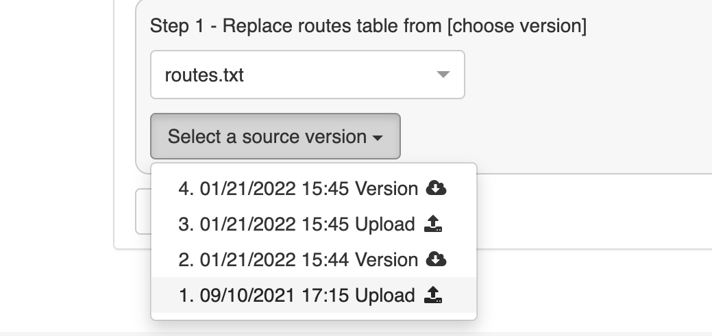
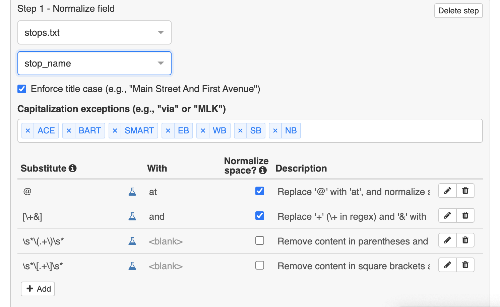
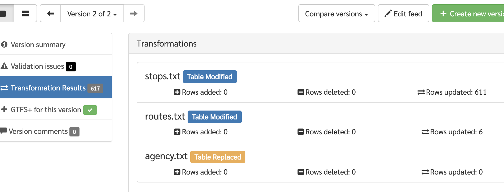

# Managing Projects and Feeds

## Creating Projects

Projects are created from the main Project listing page. Click the "New Project" button to create a new Project; a row for the new Project will appear in the table. Type a name and click the check button (or hit Enter/Return) to finish creating the Project.

## Managing Projects

Clicking on a project in the main project listing will take you to the detailed project profile page:

At the top of the page is the **Project Settings** panel which can be expanded to reveal optional properties that can be specified for the project. These include the location of the project's geographic coverage area (specified either as a single coordinate or a rectangular region), the default time zone, and default language. These values, when provided, are used to populate the corresponding feed-level properties when creating new feeds within this project.

Below the Project Settings panel is the **Feed Sources** panel. Feed Sources are the core of a project, and are documented in more detail below.

## Creating a Feed Source

Feed Sources are created from a Project's main profile page. Click the "New Feed" button to create a new feed; a row for the new Feed Source will appear in the table. Type a name and click the check button (or hit Enter/Return) to finish creating the Feed Source.

## Managing Feed Sources

After a Feed Source has been created, it will appear in the Project's table of Feed Sources. From this table, a basic summary of information for the feed is presented (including if the latest version has expired and how many validation issues it has).

To access all settings for this Feed Source, click on the its name to access the full Feed Source profile page:

At the top of the page is a set of tabs, which include:

- **GTFS** - main point of entry for Feed Source
    - Feed Version Navigator (covered in more detail below)
    - Feed Version Summary - view feed info and discover information about routes, patterns and stops
    - Validation issues - view and filter list of validation issues
    - Version comments - leave and view comments specific to a Feed Version
- **Snapshots** - list of Editor snapshots (or save points)
- **Comments** - where users can leave and view comments specific to this Feed Source
- **Settings** - access to Feed Source settings
    - Editing basic Feed Source properties such as name, fetch URL, and public visibility
    - Viewing/editing settings provided by custom extensions
    - Deleting a Feed Source (for users with sufficient permissions) in the **Danger zone** properties.

## Creating Feed Versions

Feed Versions are created from the main Feed Source profile page. There are three methods for creating new versions:

1. **Manually Upload a File**: Select "Manually Uploaded" from the `+ Create new version` dropdown. The button next to the dropdown should now say "Upload." Click the "Upload" button to select a GTFS file from your local machine.

2. **Fetch From A Remote URL**: Select "Fetch" from the `+ Create new version` dropdown. **Note:** to fetch a new version, the "Feed source fetch URL" property must be set to a valid GTFS URL under `Feed Source > Settings`.

3. **Import From the GTFS Editor**: Select "From snapshot" from the `+ Create new version` dropdown. The list of snapshots should now be visible showing any available snapshots of the feed in the Editor. Select the desired snapshot by clicking the "Publish" button to publish the snapshot as a new version.

4. **Service Period Merge** (certain Data Tools configurations only): If a Feed Source has two or more Feed Versions, a new Feed Version can be created by merging two versions representing a transit agency's service over different time periods. While viewing a particular Feed Version, click `Merge with version` (underneath the map view) to select which past version you would like to merge with.

5. **Regional Merge**: For Projects that contain multiple Feed Sources across a region, it can be useful to merge multiple transit agencies together into a combined GTFS feed for the entire region. While viewing a Project's list of Feed Sources, click `Actions > Merge all` to produce a combined GTFS file for all Feed Sources.

**Note:** when uploading or fetching a feed, and the file being uploaded or fetched is not different from the latest version, no new Feed Version will be created.

## Feed Transformations

Data Tools now supports **Feed Transformations**, which can apply a set of changes automatically to each new GTFS feed loaded into the system. This is especially helpful for applying repeatable changes to or inserting supplementary files into GTFS feeds that need to be enhanced. It provides a critical stopgap to improve GTFS coming out of systems that cannot be modified (e.g., scheduling software that has a rigid export format). The different transformation types currently supported are:

1. **Replace File From Version** - any file in an incoming GTFS (e.g., feed_info.txt) can be overwritten or inserted with a file extracted from a previously loaded feed version.

2. **Replace File From String** - any file in an incoming GTFS (e.g., feed_info.txt) can be overwritten or inserted with user-defined CSV data.

3. **Normalize Field Transformation** - values in fields can be processed in bulk and normalized, so that features such as spacing or abbreviation spelling are applied consistently throughout the feed.

### Configuring Feed Transformations

Follow the steps below to configure Feed Transformations for an existing Feed Source:

1. Select a Feed Source and click `Settings > Feed Transformations`.
2. From here, click `Add transformation` to begin creating a new set of rules for incoming GTFS feeds. Your first ruleset will automatically apply to GTFS that is fetched automatically *and* manually uploaded, but this can be changed for each ruleset to apply to any of the retrieval methods listed in [Creating Feed Versions](#creating-feed-versions).
3. Click `Add step to transformation` to select a transformation type and fill in the required fields for each type. Multiple transformations can be specified and each will be applied to the incoming GTFS file in the order that they are defined.

### Replace File From Version Transformation

1. Select the file or table to replace.
2. Select the feed version from which the desired data for the selected table will come from (see screenshot below).

### Replace File From String Transformation

1. Select the file or table to replace.
2. Enter or paste the desired CSV data for the table to replace (see screenshot below).

### Normalize Field Transformation

The Normalize Field Transformation is configured as follows (also see screenshot following the steps):

1. Select the file or table to replace.
2. From the selector below the table selector, select the field to normalize.
3. "Enforce Title Case" will convert all words to Title Case regardless of how they appear in the original feed file.
4. You can enter/remove capitalization exceptions, especially for acronyms or prepositions. Some exceptions are already configured to appear by default. The exceptions will appear as entered.
5. You can enter substitutions that will replace a search term with a replacement term. There is one substitution per row in the substitutions table. Click the Edit ("pencil") button to modify a row. Click the Delete ("X") button to remove the row. Click "Add" to add a new substitution.
   * The search term is defined using a [regular expression](https://en.wikipedia.org/wiki/Regular_expression). Use the "potion" button  to test the search term (a separate website will open to let you test how the search term behaves with various content).
   * The replacement term is normal text that will replace instances of the search term.
   * If checked, "Normalize space" will add or shrink the space surrounding the text to substitute to one space.
   For example, if "@" were replaced with "and", then "12th@&nbsp;&nbsp;&nbsp;West" would become "12th and West".
   * You can enter an optional description of what the substitution performs.

### Viewing the Feed Transformation Summary

Once the Feed Transformations have all been configured, you can import a new GTFS file using one of the retrieval methods you have specified for your ruleset. Once the GTFS file has been processed, a summary of the transformations is available by hovering over the wrench icon that is visible in the Feed Version panel.

A more in depth summary is available under the Transformation Results tab on the left sidebar. This panel will show you the modifications made to each file in the feed, along with how many rows were added, deleted, or modified. 

## Viewing and Managing Feed Versions

The Feed Version navigator allows you to navigate through all available versions of a given feed using the `←` and `→` buttons (or view a list of all versions). You can also use this interface to:

- download a Feed Version to your local machine as a GTFS data file,
- export the route patterns or stops as a shapefile (.shp),
- merge two Feed Versions into a single version (MTC only),
- publish a Feed Version externally (MTC only),
- load a version into the Editor, and
- delete a Feed Version from the Data Manager. (Note: deleting a Feed Version cannot be undone.)

To the left of the navigator is a list of views available for to the currently active version. These include basic feed statistics, the detailed feed validation report, and any user comments specific to this feed. See [Feed Version Summary](./feed-version-summary) for more.
