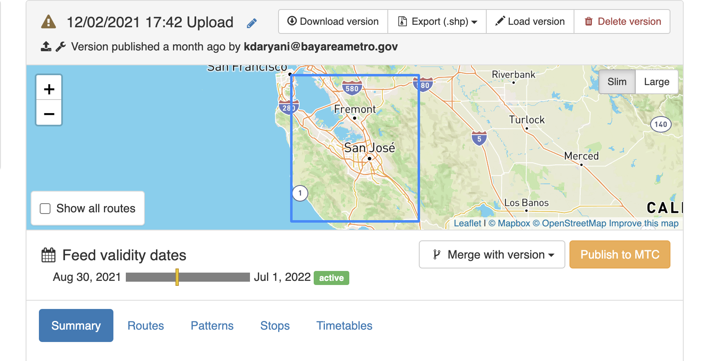

# Publishing Feeds

## Publishing a Feed Version
Once a feed version has been loaded into the manager either through direct upload, URL fetch or loaded from the editor, in order to make this feed active (i.e., available for creating alerts or visible in other 511 systems) you must first publish the feed.  This step allows users to review the feed contents (such as number of routes or stops) as well as any validation issues before beginning the publication process.

Once you have checked these details, you must click the yellow `Publish to MTC` button.

## After Publishing
After selecting a version to be published, the GTFS feed begins processing by 511 systems. This process may take some time to fully complete, but the yellow `Publish to MTC` button will change to green indicating which version is active for a given agency/feed source.

This workflow supports uploading future versions of GTFS, for example, a GTFS feed that does not become active until the next service change. It also allows you to revert to previous versions of GTFS should issues be identified with the currently active feed version.

